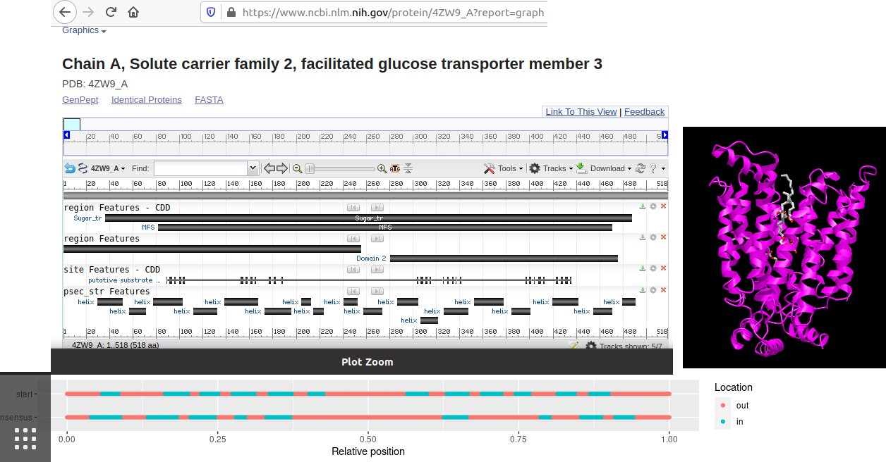

# ncbi

Branch   |[GitHub Actions](https://github.com/richelbilderbeek/ncbi/actions)                                     |
---------|-----------------------------------------------------------------------------------------------------|-------------------------------------------------------------------------------------------------------------------------------------------------------
`master` | |
`develop`||

My notes on using the NCBI data, from website and using R.

## Videos

 * Find SNPs from membrane protein gene names,
   using only the NCBI web interface 
   [YouTube](https://youtu.be/7QMUx-X5cM8)
   [download (.ogv)](http://richelbilderbeek.nl/ncbi_find_snps_from_membrane_protein_gene_names.ogv)
 * From protein name to related protein sequences,
   using both R and the NCBI web interface 
   [YouTube](https://youtu.be/7QMUx-X5cM8)
   [download (.ogv)](http://richelbilderbeek.nl/ncbi_protein_name_to_related_msa_in_r_and_web_interface.ogv)
 * From protein name to related protein sequences,
   using only the NCBI web interface 
   [R script](scripts/from_protein_to_msa_of_related_proteins.R)
   [YouTube](https://youtu.be/TGA6_4i-xTo)
   [download (.ogv)](http://richelbilderbeek.nl/ncbi_protein_name_to_related_msa.ogv)

