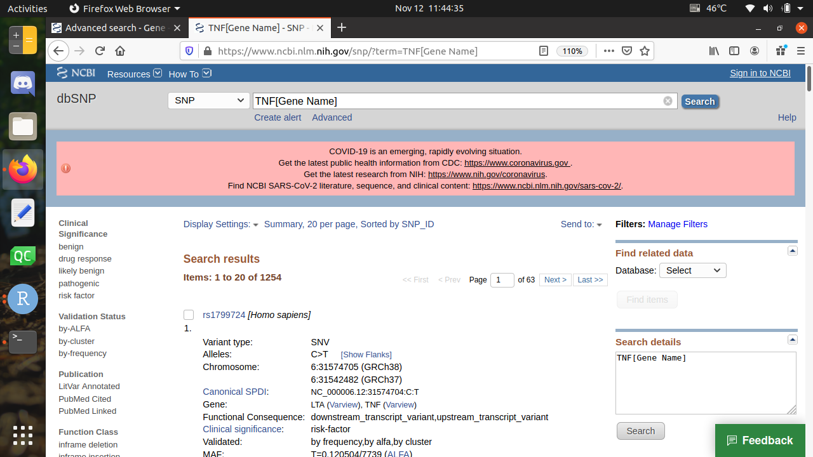
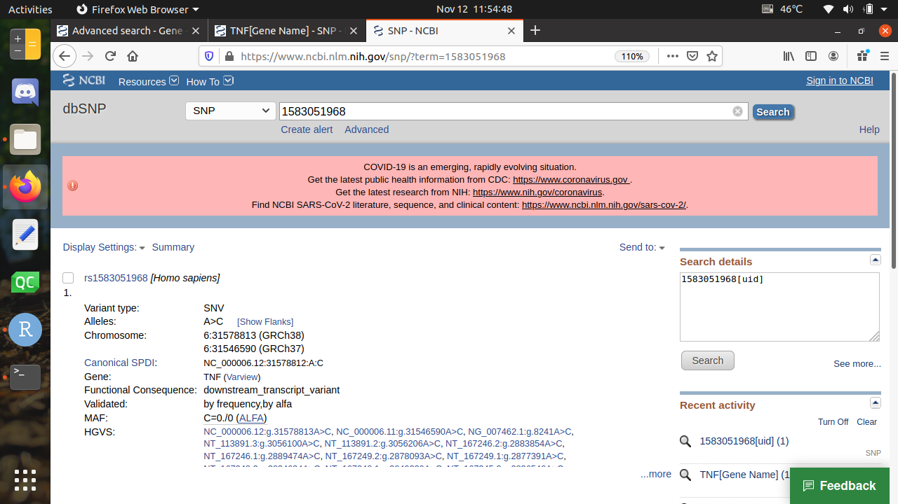
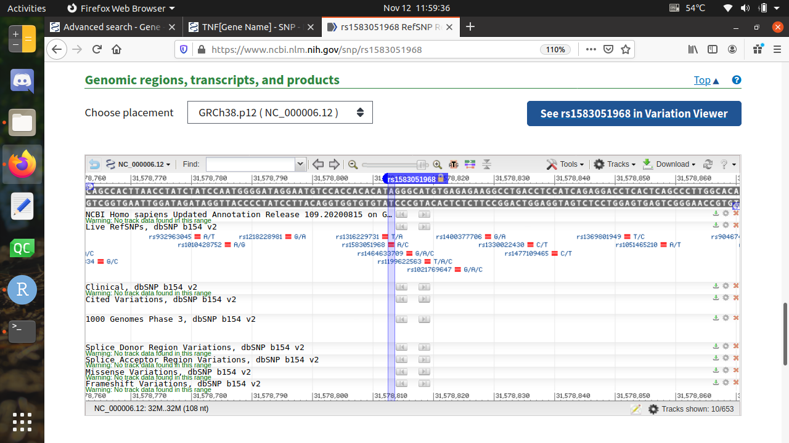
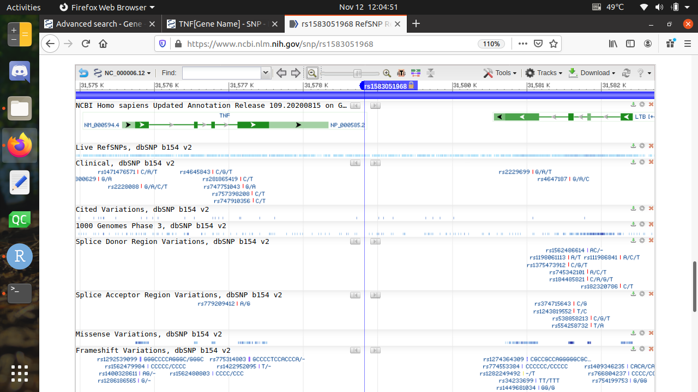
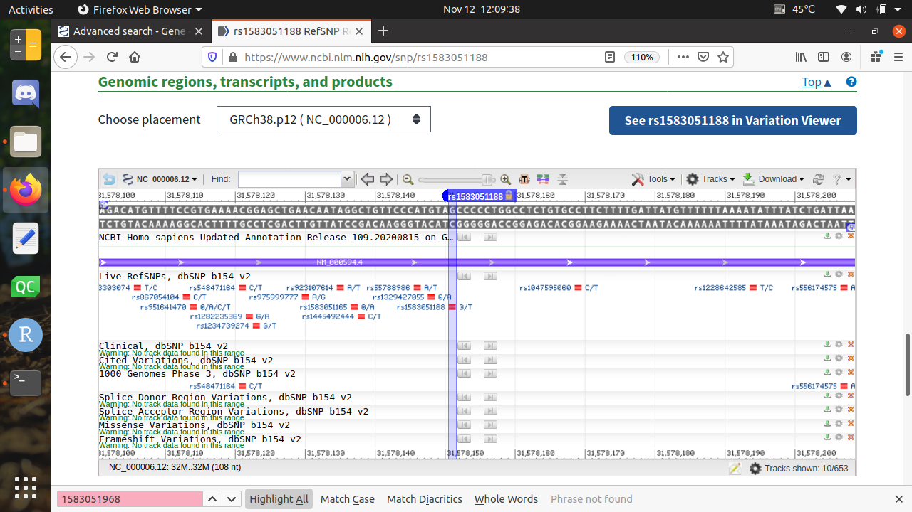
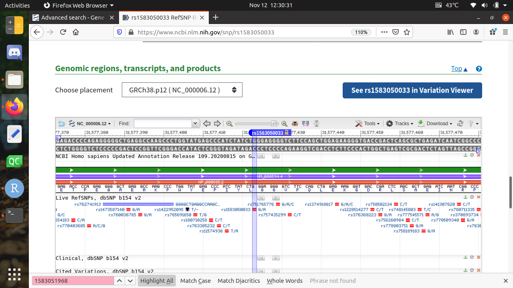
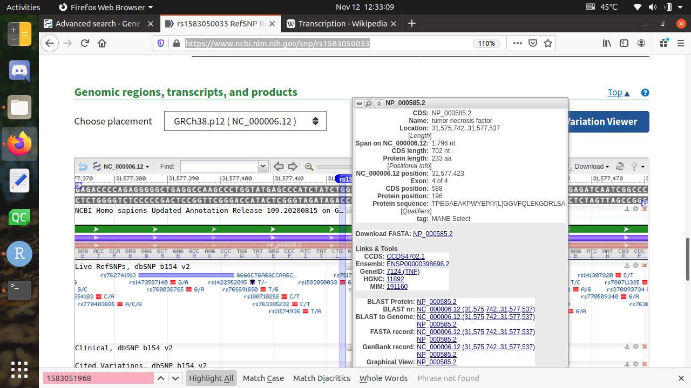

```{r, include = FALSE}
knitr::opts_chunk$set(
  collapse = TRUE,
  comment = "#>"
)
```

```{r setup}
library(ncbi)
```

## Find gene names of membrane proteins

At the NCBI website (`https://www.ncbi.nlm.nih.gov/`),
click on the 'Gene' database, then search for 'Membrane protein', for the organism *Homo sapiens*, or use the API `https://www.ncbi.nlm.nih.gov/gene?term=(membrane%20protein)%20AND%20homo%20sapiens%5BOrganism%5D` to get 1123 hits.


To do so from R:

```{r}
# Which search field does the Gene database have?
rentrez::entrez_db_searchable("gene")
```

Search for 

```{r}
# Do an NCBI search
membrane_protein_result <- rentrez::entrez_search(db = "Gene", term = "((membrane protein) AND Homo sapiens[ORGN]) AND alive[prop]")

print(paste0("Found ", membrane_protein_result$count, " matches, from the query '", membrane_protein_result$QueryTranslation, "'"))
```
Here we find 1123 matches again. We did have to expand the query, by adding `AND alive[prop]` to only show the alive entries, a thing the web interface does by default.


```{r}
# Get the membrane proteins' gene IDs
gene_ids <- head(membrane_protein_result$ids)
# head(membrane_protein_ids)

# Get the membrane protein gene names
#membrane_proteins_info <- rentrez::entrez_fetch(
membrane_proteins_info <- rentrez::entrez_summary(
  db = "gene", 
  id = gene_ids,
  rettype = "xml"
)
names(membrane_proteins_info[[1]])
membrane_proteins_info[[1]]$organism$taxid == 9606
is_human <- purrr::flatten_lgl(purrr::map(membrane_proteins_info, function(e) e$organism$taxid == 9606))
testthat::expect_true(all(is_human))
gene_names <- purrr::flatten_chr(purrr::map(membrane_proteins_info, function(e) e$name))
gene_names
```

## From a gene name, find a SNP

### Gene name without SNPS

In this example, we'll use the EFGR gene. There will be no (human) SNPs for that gene however, as we'll discover

### Gene name with SNPS

In this example, we'll use the TNF gene.

```{r}
gene_name <- gene_names[2]
testthat::expect_equal("TNF", gene_name)
```

On the NCBI website, use the SNP database and search for the gene name 'TNF', or use this API call:  `https://www.ncbi.nlm.nih.gov/snp/?term=TNF%5BGene%20Name%5D`



From R, we do:

```{r}
tnf_snp_result <- rentrez::entrez_search(
  db = "SNP", 
  term = paste0("", gene_name, "[Gene Name]")
)
print(
  paste0(
    "Got ",  tnf_snp_result$count, " hits ",
    "for query '", tnf_snp_result$QueryTranslation, "'"
  )
)
```

Note that `rentrez::entrez_search` returns only the first 20 hits by default. These are all 20 SNP IDs:

```{r}
tnf_snp_result$ids
```

## From a SNP, get the protein sequence and location

## From a SNP, that is not translated

We'll use the first SNP ID, 1583051968:

```{r}
untranslated_tnf_snp_result <- tnf_snp_result$ids[1]
testthat::expect_equal("1583051968", untranslated_tnf_snp_result)
```

To get the protein sequence using the NCBI website,
search for `1583051968` (or `rs1583051968`, the `rs` denotes
it's a SNP),
or use the API call \code{https://www.ncbi.nlm.nih.gov/snp/?term=1583051968}



Clicking on the `rs` takes us to [https://www.ncbi.nlm.nih.gov/snp/rs1583051968](https://www.ncbi.nlm.nih.gov/snp/rs1583051968). Scrolling down gives the genomic context:



As the report shows no green (nor red, nor blue) band, means that this SNP does not modify a translation product. Zooming out comfirms this:



## From a SNP, that is transcripted

We'll use the fifth SNP ID, 1583051188:

```{r}
transcripted_tnf_snp_result <- tnf_snp_result$ids[5]
testthat::expect_equal("1583051188", transcripted_tnf_snp_result)
```

At NCBI website, at [https://www.ncbi.nlm.nih.gov/snp/rs1583051188](https://www.ncbi.nlm.nih.gov/snp/rs1583051188) we can see it is transcribed to mRNA (but not to protein):



## From a SNP, that is transcripted and translated

We'll use the sevent SNP ID, 1583050033:

```{r}
translated_tnf_snp_result <- tnf_snp_result$ids[7]
testthat::expect_equal("1583050033", translated_tnf_snp_result)
```

At [https://www.ncbi.nlm.nih.gov/snp/rs1583050033](https://www.ncbi.nlm.nih.gov/snp/rs1583050033) one can see there is a protein



Hovering over the protein (that is, the red bar), we see
that the protein is called `NP_000585.2` and that our
SNP acts on the 196 amino acid.



Now, to do the same thing from R:

```{r}
# https://api.ncbi.nlm.nih.gov/variation/v0/beta/refsnp/1583050033
# 
# translated_tnf_snp_info <- rentrez::entrez_fetch(
#   db = "SNP", 
#   id = translated_tnf_snp_result,
#   rettype = "xml"
# )
# translated_tnf_snp_info
```
