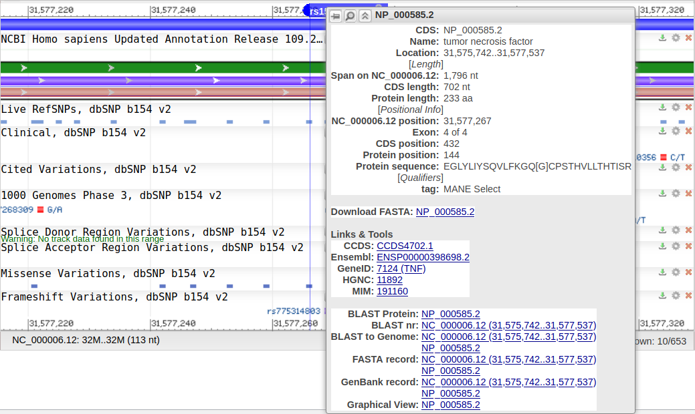
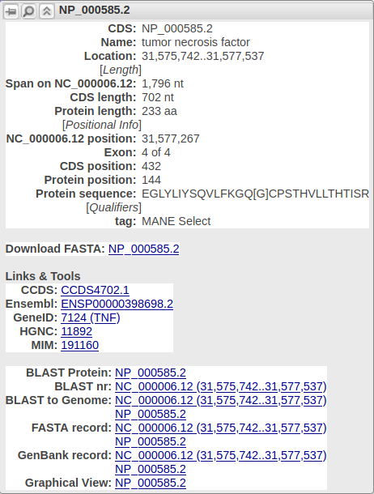

```{r, include = FALSE}
knitr::opts_chunk$set(
  collapse = TRUE,
  comment = "#>"
)
```

```{r setup}
library(ncbi)
```

## Find gene names of membrane proteins

At the NCBI website (`https://www.ncbi.nlm.nih.gov/`),
click on the 'Gene' database, then search for 'Membrane protein', for the organism *Homo sapiens*, or use the API `https://www.ncbi.nlm.nih.gov/gene?term=(membrane%20protein)%20AND%20homo%20sapiens%5BOrganism%5D` to get 1123 hits.


Search for `"((membrane protein) AND Homo sapiens[ORGN]) AND alive[prop]"`
in the `Gene` database using the `rentrez` R package:

```{r}
all_gene_ids <- get_all_human_membrane_protein_gene_ids()
length(all_gene_ids)
```

Here we find 1123 matches again. We did have to expand the query, by adding `AND alive[prop]` to only show the alive entries, a thing the web interface does by default.

From here, we select the first six:

```{r}
gene_ids <- head(all_gene_ids)
gene_ids
```
From our gene IDs, we can get the gene names:

```{r}
gene_names <- get_gene_names_from_human_gene_ids(gene_ids)
```

## From a gene name, find a SNP

In this example, we'll use the TNF gene.

```{r}
gene_name <- gene_names[2]
testthat::expect_equal("TNF", gene_name)
```

On the NCBI website, use the SNP database and search for the gene name 'TNF', or use this API call:  `https://www.ncbi.nlm.nih.gov/snp/?term=TNF%5BGene%20Name%5D`


From R, we do:

```{r}
snp_ids <- get_snp_ids_from_gene_name(gene_name)
head(snp_ids)
```

## From a SNP, get the protein sequence and location

## From a SNP, that is not translated

We'll use the first SNP ID, 1583051968:

```{r}
testthat::expect_equal("1583051968", snp_ids[1])
hgvs <- get_snp_variations_in_protein(snp_ids[1])
tryCatch(is_hgvs_in_tmh(hgvs), error = function(e) print(e))
```

To get the protein sequence using the NCBI website,
search for `1583051968` (or `rs1583051968`, the `rs` denotes
it's a SNP),
or use the API call \code{https://www.ncbi.nlm.nih.gov/snp/?term=1583051968}


Clicking on the `rs` takes us to [https://www.ncbi.nlm.nih.gov/snp/rs1583051968](https://www.ncbi.nlm.nih.gov/snp/rs1583051968). Scrolling down gives the genomic context:


As the report shows no green (nor red, nor blue) band, means that this SNP does not modify a translation product. Zooming out comfirms this:


## From a SNP, that is transcripted

We'll use the fifth SNP ID, 1583051188:

```{r}
testthat::expect_equal("1583051188", snp_ids[5])
hgvs <- get_snp_variations_in_protein(snp_ids[5])
tryCatch(is_hgvs_in_tmh(hgvs), error = function(e) print(e))
```

At NCBI website, at [https://www.ncbi.nlm.nih.gov/snp/rs1583051188](https://www.ncbi.nlm.nih.gov/snp/rs1583051188) we can see it is transcribed to mRNA (but not to protein):


## From a SNP, that is transcripted and translated into indentical protein

We'll use the sevent SNP ID, 1583050033:

```{r}
testthat::expect_equal("1583050033", snp_ids[7])
```

At [https://www.ncbi.nlm.nih.gov/snp/rs1583050033](https://www.ncbi.nlm.nih.gov/snp/rs1583050033) one can see there is a protein


Hovering over the protein (that is, the red bar), we see
that the protein is called `NP_000585.2` and that our
SNP acts on the 196 amino acid.


Now, to do the same thing from R:

```{r}
hgvs <- get_snp_variations_in_protein(snp_ids[7])
tryCatch(is_hgvs_in_tmh(hgvs), error = function(e) print(e))
```

The error message is clear: the SNP did not cause a mutation in the protein.

## From a SNP, that is transcripted and translated into indentical protein

We'll use the eight SNP ID, `1583049783`:

Here the protein is actually changed.

From this variation, we now measure where in the protein the mutation occurs:

```{r}
testthat::expect_equal("1583049783", snp_ids[8])
hgvs <- get_snp_variations_in_protein(snp_ids[8])
tryCatch({in_in_tmh <- is_hgvs_in_tmh(hgvs)}, error = function(e) print(e))
in_in_tmh
```

At [https://www.ncbi.nlm.nih.gov/snp/rs1583049783](https://www.ncbi.nlm.nih.gov/snp/rs1583049783) one can see there is a protein



Hovering over the protein (that is, the red bar), we see
that the protein is called `NP_000585.2` and that our
SNP acts on the 144 amino acid.


